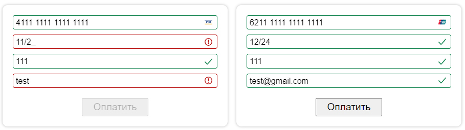

# Шаблон формы для оплаты

Сборка Webpack + card-validator и email-validator. Проект настроен\подготовлен, можно использовать как стартовый шаблон, а можно как донор.
## Info
Настроена валидация полей, определение типа платежной системы. Кнопка станет активной только при успешном заполнении всех полей. 


## Get started 
* скачать репозиторий
* открыть любимый IDE ;)
* Для установки пакетов открыть терминал в папке с проектом, выполнить:

With [NPM](https://www.npmjs.com/package/choices.js):

```zsh
npm install
```
With [Yarn](https://yarnpkg.com/):

```zsh
yarn add
```
* Для запуска
```zsh
npm start
```
* http://localhost:9000/ - откроется автоматически в браузере по умолчанию (настроен Browser sync).
